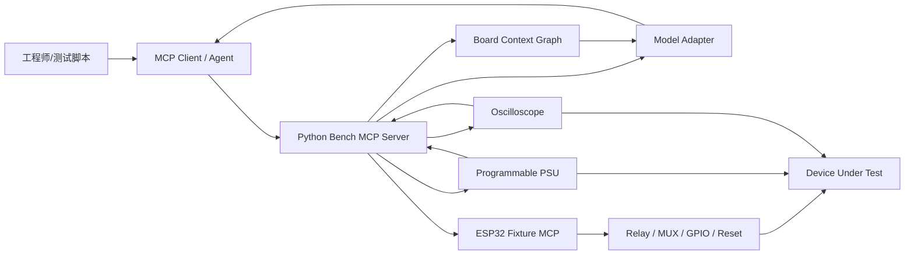

# ai-hardware

AI Hardware MCP 是一个面向硬件自动化诊断的项目。目标是把电路板的网标、拓扑、测试点、可编程电源/示波器测量结果和指定模型的分析能力连接起来，形成一个可追踪、可复现、带安全边界的诊断闭环。

## 项目目标

- 支持输入被测电路的网标、元件引脚、测试点和连接拓扑。
- 通过 Python 控制可编程电源、示波器、万用表、继电器矩阵或探针夹具。
- 将测得的电压、电流、纹波、启动时序、频谱、协议波形等特征结构化保存。
- 通过 MCP 暴露工具、资源和诊断提示词，让指定模型给出硬件诊断结果或下一步测量建议。
- 在 ESP32 上实现轻量 MCP 能力，负责板载/夹具侧动作，例如 GPIO、MUX、继电器、复位、简单 ADC 采样和 DUT 状态控制。

## 推荐架构

当前更实际的方向是“Python 测试站 + ESP32 边缘夹具”的混合架构：Python 侧负责仪器驱动、拓扑建模、信号特征提取和模型调用；ESP32 侧通过 MCP 暴露低风险、可约束的硬件动作。



## 技术选型摘要

调研日期：2026-06-14。

- Python 测试站：优先使用官方 MCP Python SDK 中的 `FastMCP` 风格接口，或 standalone FastMCP。它最适合快速把 Python 函数封装为工具、资源和提示词，也方便对接 PyVISA、示波器 SDK、SCPI 和模型 API。
- ESP32 设备侧：优先评估 Espressif `mcp-c-sdk`。它是面向 ESP32/ESP-IDF 的 C SDK，当前组件库最新版本为 `2.0.1`，支持工具、资源、提示词、补全、HTTP transport 和 client/server 场景。
- MQTT 设备网络：如果未来一台测试站要发现和管理多块 ESP32 夹具，可评估 `esp-mcp-over-mqtt` / EMQX MCP over MQTT 方案；单机实验室场景先用 HTTP 更简单。
- TypeScript SDK：适合作为 Web 控制台、远端网关或团队门户，不建议作为第一阶段仪器控制核心。

更详细的框架比较见 [docs/mcp-framework-research.md](docs/mcp-framework-research.md)。

## 仓库结构

```text
.
├── README.md
├── docs/
│   ├── architecture.md
│   ├── data-model.md
│   ├── diagnostic-workflow.md
│   ├── mcp-framework-research.md
│   └── roadmap.md
├── examples/
│   ├── boards/
│   │   └── usb_power_stage.yaml
│   └── sessions/
│       └── usb_power_stage_session.json
├── firmware/
│   └── esp32-fixture/
│       ├── CMakeLists.txt
│       ├── partitions.csv
│       ├── README.md
│       ├── sdkconfig.defaults
│       ├── main/
│       │   ├── app_main.c
│       │   ├── CMakeLists.txt
│       │   ├── idf_component.yml
│       │   └── Kconfig.projbuild
│       └── tools/
│           ├── deploy.py
│           └── smoke_test.py
└── schemas/
    ├── board_context.schema.json
    └── diagnostic_session.schema.json
```

## ESP32 固件

ESP32 侧最小可部署工程在 [firmware/esp32-fixture](firmware/esp32-fixture)。它基于 ESP-IDF 5.4+ 和 Espressif `mcp-c-sdk`，默认启动 SoftAP，并在 `http://192.168.4.1/mcp` 暴露 MCP HTTP endpoint。

```bash
cd firmware/esp32-fixture
python3 tools/deploy.py doctor
python3 tools/deploy.py build
python3 tools/deploy.py bundle --zip
python3 tools/deploy.py verify-bundle
python3 tools/deploy.py verify-bundle --bundle dist/esp32-fixture.zip
python3 tools/deploy.py preflight --bundle dist/esp32-fixture.zip
python3 tools/deploy.py provision --port /dev/tty.usbserial-XXXX --wait-port 60 --erase-flash --smoke --prompt --wait-ready 30
python3 tools/deploy.py flash-bundle --bundle dist/esp32-fixture.zip --port /dev/tty.usbserial-XXXX --wait-port 60 --identify --erase-flash --smoke --prompt --wait-ready 30
```

固件使用 4MB ESP32 分区表，factory app 分区为 3MB；构建已用 ESP-IDF v5.4.4 在 ESP32 target 上验证通过，当前 app 约 `0xe9890` 字节，app 分区剩余约 70%。`bundle` 会生成包含 bootloader、partition table、app、`flash_args`、`manifest.json`、命令文件和 SHA-256 的烧录包；`verify-bundle` 会交叉检查 manifest、哈希、flash args、命令文件、README 和 app 分区尺寸。烧录后连接默认 SoftAP，再运行：

如果只想烧录已经生成并校验过的固件包，不重新 build，可以使用 `flash-bundle`。它支持 `dist/esp32-fixture` 目录和 `dist/esp32-fixture.zip`，会先校验包内容，再按 bundle 里的 `flash_args` 通过 esptool 写入 ESP32。
烧录前需要当前 Python 环境能运行 `python -m esptool`；source ESP-IDF 的 `export.sh` 会提供这个环境，`doctor` 会显示当前 shell 是否可用。
加 `--identify` 时，脚本会在擦写前读取 ESP32 MAC 和 flash ID，确认串口上的芯片可通信。
`flash-bundle --smoke` 未显式传入 host/port/endpoint 时，会使用 bundle manifest 里的 MCP 连接信息。
`preflight` 会把 ESP-IDF、esptool、构建产物、bundle/zip 校验和串口状态集中输出；默认适合烧录现成 zip 的测试站，加 `--require-port`、`--require-idf` 或 `--require-build` 可以把对应项当作失败处理。

```bash
python3 tools/deploy.py smoke --bundle dist/esp32-fixture.zip --wait-ready 30
```

要验证“按当前待测板网标动态映射到 MUX channel”的链路，可在确认夹具空载或接线安全后运行：

```bash
python3 tools/deploy.py smoke --bundle dist/esp32-fixture.zip --wait-ready 30 --exercise-runtime-net
```

Python 测试站也可以直接下发当前 DUT 的 runtime 网标映射：

```bash
python3 tools/deploy.py load-net-map --dry-run --clear-existing \
  --mappings-json '[{"net":"VIN","channel":0},{"net":"3V3","channel":1}]'
python3 tools/deploy.py load-net-map --wait-ready 30 --clear-existing \
  --mappings-json '[{"net":"VIN","channel":0},{"net":"3V3","channel":1}]'
```

第一版工具包括 `fixture.ping`、`fixture.get_status`、`fixture.self_test`、`fixture.set_mux_channel`、`fixture.select_net`、`fixture.set_runtime_net`、`fixture.set_runtime_net_map`、`fixture.clear_runtime_net`、`fixture.clear_runtime_net_map`、`fixture.reset_dut`、`fixture.set_load_switch`、`fixture.read_digital_input`、`fixture.scan_digital_inputs`、`fixture.read_adc_raw`、`fixture.read_net_adc_raw`、`fixture.scan_net_adc` 和 `fixture.sample_net_adc_series`。资源包括 `fixture://status`、`fixture://net-map` 和 `fixture://digital-inputs`。ADC 工具会返回 raw 采样值，并在校准可用时返回 ADC 引脚毫伏值和按夹具比例换算后的 `scaled_mv_*`；scan 工具会返回所有已配置网标的快照，series 工具会返回单个网标的短时间序列，runtime net 工具可在不重刷固件的情况下把当前待测板网标映射到 MUX channel，`fixture.set_runtime_net_map` 支持 Python 测试站一次性加载当前 DUT 的多条网标映射，数字输入工具用于读取 PGOOD、FAULT、IRQ、BOOT 等状态脚，供 Python 测试站提取信号特征并调用模型诊断。`fixture.self_test` 会检查输出 GPIO、数字输入 GPIO、MUX 通道可表示性、网标/测试点映射、ADC 初始化、series 限制和 heap 状态。真实接板前请先用 `idf.py menuconfig` 检查 GPIO 映射、数字输入映射、网标映射、MUX 稳定等待时间、ADC 校准/缩放、连续采样上限和动作极性。

## Python Bench 原型

Python 测试站原型在 [bench/ai_hardware_bench](bench/ai_hardware_bench)。这一层不依赖 ESP32 实机，也不强制安装 `mcp`、`fastmcp`、`yaml` 或 `jsonschema`；当前实现用标准库完成板级文件加载、轻量校验、拓扑查询、mock PSU、mock scope、mock fixture、波形特征提取、规则诊断、CSV/KiCad XML 导入和 MCP-shaped stdio JSON-RPC 入口。

常用命令：

```bash
python3 tools/bench.py validate-board examples/boards/usb_power_stage.yaml
python3 tools/bench.py demo \
  --board examples/boards/usb_power_stage.yaml \
  --output-session artifacts/mock-bench/session.json
python3 tools/bench.py validate-session artifacts/mock-bench/session.json
python3 tools/bench.py run-regression
python3 tools/bench.py run-regression \
  --suite examples/regressions/usb_power_stage.json \
  --artifact-dir artifacts/regression-suite \
  --output artifacts/regression-suite/result.json
python3 tools/bench.py report \
  --session artifacts/regression-suite/usb_power_stage_vout_collapse/session.json \
  --output artifacts/regression-suite/usb_power_stage_vout_collapse/report.html \
  --audit artifacts/regression-suite/usb_power_stage_vout_collapse/audit.jsonl
python3 tools/bench.py console \
  --board examples/boards/usb_power_stage.yaml \
  --artifact-dir artifacts/console
python3 tools/bench.py check --output artifacts/check/result.json
python3 tools/bench.py call-tool list_nets \
  --board examples/boards/usb_power_stage.yaml \
  --arguments '{"domain":"power"}'
python3 tools/bench.py call-tool plan_initial_measurements \
  --board examples/boards/usb_power_stage.yaml
python3 tools/bench.py serve --board examples/boards/usb_power_stage.yaml
```

首批 bench 工具覆盖 `load_board_context`、`instrument_status`、`model_status`、`safety_status`、`validate_session`、`read_audit_log`、`plan_initial_measurements`、`list_nets`、`trace_net_neighbors`、`find_test_points`、`trace_power_path`、`list_downstream_loads`、`set_power_rail`、`measure_dc_voltage`、`measure_impedance`、`capture_waveform`、`capture_scope_screenshot`、`extract_signal_features`、`diagnose_hardware`、`suggest_next_probe`、`esp32_set_mux` 和 `esp32_reset_dut`。`demo` 会生成 mock 波形 CSV、session JSON、诊断 finding、下一步测量建议和 JSONL 审计日志。

stdio MCP server 支持 `tools/list`、`tools/call`、`resources/list`、`resources/read`、`prompts/list` 和 `prompts/get`。资源包括 `board://context/{board_id}`、`board://topology/{board_id}`、`board://net/{board_id}/{net_name}`、`session://measurements/{session_id}` 和 `session://artifacts/{session_id}/{artifact_id}`；文本 artifact（例如 waveform CSV）会以内联文本返回。当前 prompts 包括 `diagnose_power_rail`、`diagnose_boot_sequence` 和 `plan_next_measurement`，会把已加载的 board/session/topology/measurement 摘要整理成可发给模型的结构化提示。

安全策略默认拒绝未确认的高风险动作：例如 `SW_NODE` 这种 `risk_level: high` 的波形采集，或非 dry-run 的电源/夹具动作。确实要执行时，需要显式传入 `confirm: true`：

```bash
python3 tools/bench.py call-tool capture_waveform \
  --board examples/boards/usb_power_stage.yaml \
  --arguments '{"net":"SW_NODE","confirm":true}'
python3 tools/bench.py call-tool capture_scope_screenshot \
  --board examples/boards/usb_power_stage.yaml \
  --arguments '{"net":"VOUT_3V3"}'
```

DMM 测量工具会把直流电压或断电阻抗写入当前 session，并复用 test point 的 `allowed_measurements` 约束。阻抗测量默认要求 `power_state: "off"`：

```bash
python3 tools/bench.py call-tool measure_impedance \
  --board examples/boards/usb_power_stage.yaml \
  --arguments '{"net":"VOUT_3V3"}'
python3 tools/bench.py call-tool measure_dc_voltage \
  --board examples/boards/usb_power_stage.yaml \
  --arguments '{"net":"VOUT_3V3"}'
```

拓扑查询：

```bash
python3 tools/bench.py call-tool find_test_points \
  --board examples/boards/usb_power_stage.yaml \
  --arguments '{"net":"VOUT_3V3","measurement":"waveform"}'
python3 tools/bench.py call-tool trace_power_path \
  --board examples/boards/usb_power_stage.yaml \
  --arguments '{"net":"VOUT_3V3"}'
python3 tools/bench.py call-tool list_downstream_loads \
  --board examples/boards/usb_power_stage.yaml \
  --arguments '{"rail":"3V3_BUCK","depth":1}'
```

审计和 session 校验：

```bash
python3 tools/bench.py call-tool plan_initial_measurements \
  --board examples/boards/usb_power_stage.yaml \
  --arguments '{"max_actions":6,"risk_ceiling":"medium"}'
python3 tools/bench.py call-tool safety_status --board examples/boards/usb_power_stage.yaml
python3 tools/bench.py call-tool read_audit_log --board examples/boards/usb_power_stage.yaml
python3 tools/bench.py validate-session artifacts/mock-bench/session.json
```

可回归诊断任务集放在 [examples/regressions](examples/regressions)。`run-regression --suite` 会逐个运行任务、保存 session/artifact/audit，并检查预期 severity、summary 片段、下一步测量网标或动作类型；任务也可以用 `tool_calls` 声明诊断前要执行的测量序列。当前 USB 电源链路样板覆盖 3V3 输出塌陷、输出纹波过大、输出过压停机和 enable 未拉高。`report` 会把 session 和 audit 汇总成一个静态 HTML 报告，便于回看诊断证据、测量特征、artifact 引用、波形 CSV 预览和工具调用记录。

`console` 会启动一个仅绑定本机的轻量 Web 控制台，默认地址是 `http://127.0.0.1:8766`。控制台可以导入 CSV/KiCad XML 板卡上下文、查看当前板卡摘要、仪器/model 状态、net/test point 拓扑表，生成首轮低风险测量计划，运行 mock demo 或 regression，回放最近 demo 的波形 CSV artifact，并打开生成的 HTML 报告。它只依赖 Python 标准库，适合先作为 notebook/Web 控制台之前的本地工程台面。

`check` 是无硬件质量门槛，会依次执行板卡校验、Python 编译、单元测试、回归 suite、HTML 报告生成，并在存在 ESP32 bundle 时验证 `firmware/esp32-fixture/dist/esp32-fixture.zip`。在没有 ESP32 bundle 的环境里可加 `--skip-esp32-bundle`。

导入板级上下文：

```bash
python3 tools/bench.py import-board \
  --format csv \
  --input path/to/testpoints.csv \
  --output artifacts/imported-board.json \
  --board-id imported_demo \
  --name "Imported Demo"

python3 tools/bench.py import-board \
  --format kicad \
  --input path/to/netlist.xml \
  --output artifacts/imported-kicad-board.json \
  --board-id imported_kicad \
  --name "Imported KiCad Board"
```

同样的 CSV/KiCad XML 内容也可以在本地 `console` 的 Import Board 面板里导入；导入成功后控制台会把当前 board 切换到生成的 `board_context.json`。

默认 driver 是 mock；要试接真实 SCPI 仪器，可以传一个 JSON 配置。没有安装 PyVISA 或 VISA backend 时，只有显式启用 SCPI 才会报错，mock 流程不受影响。mock DMM 会合成 DC 电压和断电阻抗，mock scope 会保存 CSV 波形和 SVG 截图 artifact；SCPI DMM 默认使用 `MEASure:VOLTage:DC?` 和 `MEASure:RESistance?` 查询，SCPI scope 路径会用 `WAVeform:DATA?` 采集 CSV，并预留 `DISPlay:DATA? PNG` 硬拷贝截图命令。

```json
{
  "psu": {
    "backend": "scpi",
    "id": "bench_psu",
    "resource": "TCPIP::192.168.1.50::INSTR",
    "channel": "CH1"
  },
  "scope": {
    "backend": "scpi",
    "id": "bench_scope",
    "resource": "TCPIP::192.168.1.60::INSTR",
    "channel": "CHANnel1"
  },
  "dmm": {
    "backend": "scpi",
    "id": "bench_dmm",
    "resource": "USB0::0x1234::0x5678::DMM::INSTR"
  }
}
```

```bash
python3 tools/bench.py call-tool instrument_status \
  --board examples/boards/usb_power_stage.yaml \
  --instrument-config instruments.local.json
```

模型适配默认使用本地规则引擎。要接本地或私有模型网关，可以使用通用 HTTP JSON adapter；该 endpoint 收到 board/session/topology JSON，并返回 `finding` 和 `next_actions`。返回内容会在写入 session 前按诊断 session 合约校验：`finding` 需要 `id`、`timestamp`、`summary`、`confidence`，`next_actions` 需要合法 `type`、`reason`、`risk_level`；引用的 net、test point、component 必须存在，高风险 net 的建议动作必须带 `requires_confirmation: true`。

```json
{
  "backend": "json_http",
  "id": "local_model_gateway",
  "endpoint": "http://127.0.0.1:8080/diagnose",
  "timeout_s": 30
}
```

```bash
python3 tools/bench.py call-tool model_status \
  --board examples/boards/usb_power_stage.yaml \
  --model-config model.local.json
```

本机无硬件检查：

```bash
PYTHONPATH=bench python3 -m unittest discover -s tests
python3 -m py_compile $(rg --files -g '*.py')
python3 tools/bench.py run-regression
python3 tools/bench.py run-regression --suite examples/regressions/usb_power_stage.json
python3 tools/bench.py check --output artifacts/check/result.json
```

## 核心 MCP 表面

第一阶段建议暴露这些能力：

- Resources：`board://context/{board_id}`、`board://topology/{board_id}`、`session://measurements/{session_id}`。
- Tools：`load_board_context`、`plan_initial_measurements`、`list_nets`、`trace_net_neighbors`、`find_test_points`、`trace_power_path`、`list_downstream_loads`、`set_power_rail`、`measure_dc_voltage`、`measure_impedance`、`capture_waveform`、`capture_scope_screenshot`、`extract_signal_features`、`diagnose_hardware`、`suggest_next_probe`、`esp32_set_mux`、`esp32_reset_dut`。
- Prompts：`diagnose_power_rail`、`diagnose_boot_sequence`、`plan_next_measurement`。

## 安全原则

- 所有电源输出必须有电压、电流、功率、上升时间和超时限制。
- 模型只能建议动作；高风险动作需要工具层校验，必要时需要人工确认。
- ESP32 侧只暴露 allowlist 工具，不暴露任意命令执行。
- 每次测量都写入 session，保留仪器设置、原始数据引用、提取特征和模型判断依据。

## 近期路线

1. 固化 `board_context` 和 `diagnostic_session` 数据契约。
2. 实现 Python Bench MCP Server 原型，先 mock 仪器，再接入真实 PSU/Scope。
3. 增加 KiCad/Altium/BOM/网表导入器，把网标转换成拓扑图。
4. 基于 ESP-IDF + Espressif `mcp-c-sdk` 实现 ESP32 Fixture MCP。
5. 做一块小型电源链路样板，沉淀可回归的诊断任务集。

## 参考资料

- [Model Context Protocol 官方介绍](https://modelcontextprotocol.io/docs/getting-started/intro)
- [Model Context Protocol 官方 SDK 列表](https://modelcontextprotocol.io/docs/sdk)
- [MCP Python SDK](https://py.sdk.modelcontextprotocol.io/)
- [FastMCP](https://gofastmcp.com/getting-started/welcome)
- [Espressif mcp-c-sdk](https://components.espressif.com/components/espressif/mcp-c-sdk)
- [EMQX esp-mcp-over-mqtt](https://github.com/emqx/esp-mcp-over-mqtt)
