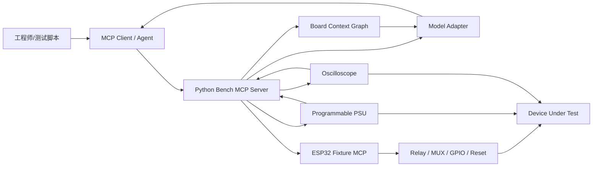

# ai-hardware

AI Hardware MCP 是一个面向硬件自动化诊断的项目。目标是把电路板的网标、拓扑、测试点、可编程电源/示波器测量结果和指定模型的分析能力连接起来，形成一个可追踪、可复现、带安全边界的诊断闭环。

## 项目目标

- 支持输入被测电路的网标、元件引脚、测试点和连接拓扑。
- 通过 Python 控制可编程电源、示波器、万用表、继电器矩阵或探针夹具。
- 将测得的电压、电流、纹波、启动时序、频谱、协议波形等特征结构化保存。
- 通过 MCP 暴露工具、资源和诊断提示词，让指定模型给出硬件诊断结果或下一步测量建议。
- 在 ESP32 上实现轻量 MCP 能力，负责板载/夹具侧动作，例如 GPIO、MUX、继电器、复位、简单 ADC 采样和 DUT 状态控制。

## 推荐架构

当前更实际的方向是“Python 测试站 + ESP32 边缘夹具”的混合架构：Python 侧负责仪器驱动、拓扑建模、信号特征提取和模型调用；ESP32 侧通过 MCP 暴露低风险、可约束的硬件动作。



## 技术选型摘要

调研日期：2026-06-14。

- Python 测试站：优先使用官方 MCP Python SDK 中的 `FastMCP` 风格接口，或 standalone FastMCP。它最适合快速把 Python 函数封装为工具、资源和提示词，也方便对接 PyVISA、示波器 SDK、SCPI 和模型 API。
- ESP32 设备侧：优先评估 Espressif `mcp-c-sdk`。它是面向 ESP32/ESP-IDF 的 C SDK，当前组件库最新版本为 `2.0.1`，支持工具、资源、提示词、补全、HTTP transport 和 client/server 场景。
- MQTT 设备网络：如果未来一台测试站要发现和管理多块 ESP32 夹具，可评估 `esp-mcp-over-mqtt` / EMQX MCP over MQTT 方案；单机实验室场景先用 HTTP 更简单。
- TypeScript SDK：适合作为 Web 控制台、远端网关或团队门户，不建议作为第一阶段仪器控制核心。

更详细的框架比较见 [docs/mcp-framework-research.md](docs/mcp-framework-research.md)。

## 仓库结构

```text
.
├── README.md
├── docs/
│   ├── architecture.md
│   ├── data-model.md
│   ├── diagnostic-workflow.md
│   ├── mcp-framework-research.md
│   └── roadmap.md
├── examples/
│   ├── boards/
│   │   └── usb_power_stage.yaml
│   └── sessions/
│       └── usb_power_stage_session.json
└── schemas/
    ├── board_context.schema.json
    └── diagnostic_session.schema.json
```

## 核心 MCP 表面

第一阶段建议暴露这些能力：

- Resources：`board://context/{board_id}`、`board://topology/{board_id}`、`session://measurements/{session_id}`。
- Tools：`load_board_context`、`list_nets`、`trace_net_neighbors`、`set_power_rail`、`capture_waveform`、`extract_signal_features`、`diagnose_hardware`、`suggest_next_probe`、`esp32_set_mux`、`esp32_reset_dut`。
- Prompts：`diagnose_power_rail`、`diagnose_boot_sequence`、`plan_next_measurement`。

## 安全原则

- 所有电源输出必须有电压、电流、功率、上升时间和超时限制。
- 模型只能建议动作；高风险动作需要工具层校验，必要时需要人工确认。
- ESP32 侧只暴露 allowlist 工具，不暴露任意命令执行。
- 每次测量都写入 session，保留仪器设置、原始数据引用、提取特征和模型判断依据。

## 近期路线

1. 固化 `board_context` 和 `diagnostic_session` 数据契约。
2. 实现 Python Bench MCP Server 原型，先 mock 仪器，再接入真实 PSU/Scope。
3. 增加 KiCad/Altium/BOM/网表导入器，把网标转换成拓扑图。
4. 基于 ESP-IDF + Espressif `mcp-c-sdk` 实现 ESP32 Fixture MCP。
5. 做一块小型电源链路样板，沉淀可回归的诊断任务集。

## 参考资料

- [Model Context Protocol 官方介绍](https://modelcontextprotocol.io/docs/getting-started/intro)
- [Model Context Protocol 官方 SDK 列表](https://modelcontextprotocol.io/docs/sdk)
- [MCP Python SDK](https://py.sdk.modelcontextprotocol.io/)
- [FastMCP](https://gofastmcp.com/getting-started/welcome)
- [Espressif mcp-c-sdk](https://components.espressif.com/components/espressif/mcp-c-sdk)
- [EMQX esp-mcp-over-mqtt](https://github.com/emqx/esp-mcp-over-mqtt)
