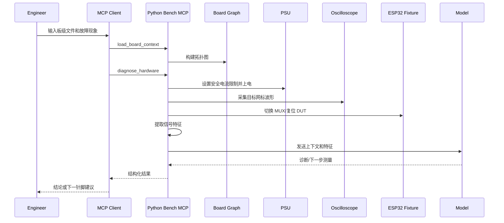

# 系统架构

本项目建议把“诊断智能”和“物理控制”分层。Python 测试站负责复杂决策，ESP32 负责夹具侧的确定性动作。

## 组件

### Python Bench MCP Server

职责：

- 加载 `board_context`，构建网标/元件/引脚拓扑图。
- 连接可编程电源、示波器、万用表、电子负载等仪器。
- 执行安全策略，例如通道 allowlist、电压/电流上限、动作超时、上电斜率。
- 从原始测量中提取信号特征。
- 调用指定模型，把诊断输入和输出固定成结构化 JSON。
- 通过 MCP 暴露 resources、tools 和 prompts。

### ESP32 Fixture MCP

职责：

- 控制继电器、模拟开关、MUX、负载开关、DUT reset/boot pins。
- 读取夹具侧 ADC、GPIO、电源良好信号或温度传感器。
- 提供少量低风险工具，不允许任意 shell、任意内存访问或任意网络请求。
- 支持 HTTP transport；多夹具时可迁移到 MQTT transport。

### Board Context Graph

板级上下文是诊断的核心。它把网标、元件、引脚、测试点、电源轨、约束和期望信号组织成图：

- 节点：net、component、pin、test_point、rail、instrument_channel。
- 边：`pin_on_net`、`test_point_on_net`、`rail_feeds_net`、`measurement_targets_net`、`component_neighbor`。
- 属性：电压范围、频率范围、启动顺序、器件型号、风险等级、可测性。

### Model Adapter

模型适配层把不同模型供应商隔离出去。诊断工具只依赖统一接口：

- `analyze_signal_features(input) -> diagnosis`
- `suggest_next_measurements(input) -> next_actions`
- `explain_topology_risk(input) -> risk_notes`

这样后续可以在 OpenAI、Anthropic、本地模型、私有模型之间切换，而不影响仪器工具和板级数据模型。

## 数据流

## MCP 资源

建议资源 URI：

- `board://context/{board_id}`：完整板级上下文。
- `board://topology/{board_id}`：拓扑图摘要和邻接查询结果。
- `board://net/{board_id}/{net_name}`：单个网标的元件、引脚、测试点、期望范围。
- `session://measurements/{session_id}`：本轮诊断已获得的测量。
- `session://artifacts/{session_id}/{artifact_id}`：原始波形、截图、CSV、二进制采样文件的引用。

## MCP 工具

建议首批工具：

| 工具 | 作用 | 安全策略 |
| --- | --- | --- |
| `load_board_context` | 加载板级上下文并校验 schema | 只读文件路径 allowlist |
| `list_nets` | 查询网标、别名、领域、电压范围 | 无副作用 |
| `trace_net_neighbors` | 查询某网标附近元件和拓扑路径 | 限制最大深度 |
| `set_power_rail` | 设置电源电压、电流、输出状态 | 电压/电流/通道上限 |
| `capture_waveform` | 采集某测试点波形 | 通道映射 allowlist |
| `extract_signal_features` | 从波形提取纹波、频率、占空比等 | 无副作用 |
| `diagnose_hardware` | 调用模型做结构化诊断 | 输出必须 schema 校验 |
| `suggest_next_probe` | 给出下一步测量点 | 高风险动作需人工确认 |
| `esp32_set_mux` | 切换夹具 MUX/继电器 | 通道 allowlist 和互锁 |
| `esp32_reset_dut` | 控制 DUT reset/boot pins | 限制脉宽和状态 |

## 不把所有 MCP 都放到 ESP32 的原因

ESP32 可以跑 MCP，但不应承担全部诊断闭环。示波器波形、模型上下文、密钥、长时日志和复杂拓扑算法都更适合放在 Python 站。ESP32 侧越小越可审计：工具少、参数小、风险边界清楚，硬件调试会舒服很多。
